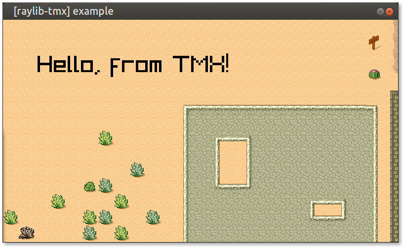

# raylib-tmx

Load [Tiled](https://www.mapeditor.org) `.tmx` files for tile maps in [raylib](https://www.raylib.com), with [TMX C Loader](https://github.com/baylej/tmx).



## Usage

This is a header-only library. To use it, define `RAYLIB_TMX_IMPLEMENTATION` in one *.c* source file before including *[raylib-tmx.h](include/raylib-tmx.h)*. You will also have to link its dependencies:

- [raylib](https://www.raylib.com/)
- [tmx](https://github.com/baylej/tmx) - With [tmx_load_buffer_path()](https://github.com/baylej/tmx/pull/58)
- [libxml2](http://xmlsoft.org)
- [zlib](http://zlib.net/) (optional)

If you're using CMake, *libxml2* and *zlib* come packed in.

### Example

``` c
#include "raylib.h"

#define RAYLIB_TMX_IMPLEMENTATION
#include "raylib-tmx.h"

int main() {
    InitWindow(800, 450, "[raylib-tmx] example");

    tmx_map* map = LoadTMX("desert.tmx");

    while(!WindowShouldClose()) {

        BeginDrawing();
        {
            ClearBackground(RAYWHITE);
            DrawTMX(map, 0, 0, WHITE);
        }
        EndDrawing();
    }

    UnloadTMX(map);

    CloseWindow();
    return 0;
}
```

See the [example directory](example) for a demonstration of how to use *raylib-tmx*. Refer to the [libTMX documentation](http://libtmx.rtfd.io/) to see how to use the `tmx_map*` map object beyond rendering.

### API

``` c
tmx_map* LoadTMX(const char* fileName);
void UnloadTMX(tmx_map* map);
Color ColorFromTMX(uint32_t color);
void DrawTMX(tmx_map *map, int posX, int posY, Color tint);
void DrawTMXLayer(tmx_map *map, tmx_layer *layers, int posX, int posY, Color tint);
void DrawTMXTile(tmx_tile* tile, int posX, int posY, Color tint);
```

## Development

To build the example locally, and run tests, use [cmake](https://cmake.org/).

``` bash
git submodule update --init
mkdir build
cd build
cmake ..
make
cd examples
./raylib-tmx-example
```

## Alternatives

This is not the only attempt to get Tiled working in raylib...

- [raylib-tileson](https://github.com/robloach/raylib-tileson)
- [raylib-tiled](https://github.com/RobLoach/raylib-tiled)

## Credits

This uses the [TMX C Loader](https://github.com/baylej/tmx), which is licensed under the [BSD 2-Clause "Simplified" License](https://github.com/baylej/tmx/blob/master/COPYING). Thank you to [Bayle Jonathan](https://github.com/baylej) for putting it together, and the [tmx example](https://github.com/baylej/tmx/blob/master/examples/raylib/raylib.c) this was inspired from.

## License

*raylib-tmx* is licensed under an unmodified zlib/libpng license, which is an OSI-certified, BSD-like license that allows static linking with closed source software. Check [LICENSE](LICENSE) for further details.
